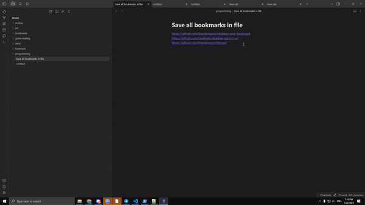

# Obsidian Plugin: Save bookmarks into markdown

Saves bookmarks to markdown.

# Installation

Available in the community plugin store in options.

# Commands

- **Extract**: If you select a URL in the document and execute command, it will save the link to a new markdown file with the title from the url in the filename
- **Bookmark All Links**: Extract every `https://url.com` url found in the document. and create markdown files for each in `bookmarks` folder.
- **Import from Clipboard**: Save the link from clipboard to a new markdown file with the title from the url in the filename